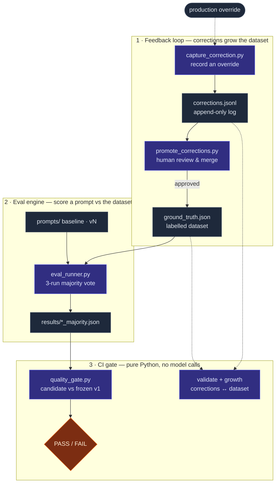
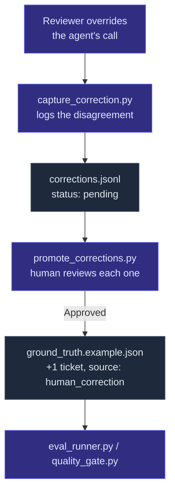

# Prompt Eval Gate

**Decision support for releasing AI prompt changes.** Every prompt change is scored against a labelled dataset, compared with the current baseline, and blocked if it makes the AI worse, so release decisions rest on evidence rather than a few spot checks.

It evaluates a real agent: [Automation Layer Adviser](https://github.com/aastha0208/automation-layer-adviser), a GitHub Action that uses Claude to recommend the right test-automation layer for engineering tickets. That repo is the agent; this one decides whether a change to the agent's prompt is safe to ship. It's built so anyone running a Claude-powered agent in CI can fork and adapt it.

## The problem this solves

LLM prompt quality is hard to measure. A single word change can silently shift the agent's behaviour across many inputs. Eyeballing a few outputs catches obvious regressions but misses subtle ones. By the time you notice production has drifted, it's been drifting for weeks.

This repo treats the prompt the way you'd treat a function:

- A labelled dataset of historical inputs with human-verified correct outputs
- An automated runner that scores every prompt version against the dataset
- A CI quality gate that blocks merges if a regression sneaks in
- Three-run majority voting to average out LLM non-determinism
- A feedback loop that captures human overrides in production and promotes the genuine ones into new dataset fixtures — so the dataset keeps learning from reality instead of staying frozen at whatever someone thought to write down on day one

## Architecture at a glance

Three subsystems, one cycle. The feedback loop turns human corrections into dataset tickets; the eval engine scores prompts against that dataset; the CI gate blocks regressions — all in pure Python, with the only model calls happening locally. Production overrides flow back to the start, so the loop compounds instead of going stale.



Solid arrows are data flow; dashed arrows are human/production input and the consistency checks. The sections below drill into each half.

## How it works

Zooming in on the eval engine (subsystem 2 above): the runner sends each row of the dataset through the prompt under test (via the `claude` CLI), captures the structured output, and scores it against the ground truth as `match`, `partial`, or `mismatch`. With `--runs 3` it does this three times per prompt and takes the per-row majority — small enough to be cheap, large enough to wash out single-run noise on borderline rows.

A candidate is accepted only if its majority results match-or-beat the baseline. The CI gate is pure Python — model calls happen locally before opening a PR, and the gate just compares two committed JSON files. Fast, free per PR, and resistant to flakes.

## Closing the loop: feedback capture

The gate above answers "does this prompt still beat the dataset we have?" It says nothing about whether that dataset still reflects reality. `evals/feedback/` is the other half: when a reviewer overrides the agent's recommendation on a real ticket, that disagreement is captured, reviewed, and — if it's a genuine labelling gap rather than a one-off judgment call — promoted into a new, permanent dataset fixture.



Capture is deliberately low-friction — one CLI call at the moment of disagreement. Promotion is deliberately not automatic — a human reviews every pending correction before it becomes ground truth, because not every override is a real labelling gap. See [`evals/feedback/README.md`](evals/feedback/README.md) for the full design and usage.

## Repo layout

```
prompt-eval-gate/
├── README.md                          ← you are here
├── .github/workflows/
│   ├── eval-gate.yml                  ← CI workflow that runs the gate + feedback checks on PRs
│   └── eval-gate-ci-model.yml.example ← the road not taken: CI-runs-the-model variant (inactive)
└── evals/
    ├── README.md                      ← operational steps for testing a prompt change
    ├── runner/
    │   ├── eval_runner.py             ← scores a prompt against the dataset
    │   └── quality_gate.py            ← compares candidate vs baseline, exits 0/1
    ├── datasets/
    │   └── ground_truth.example.json  ← 9 tickets: 8 synthetic + 1 promoted from a real correction
    ├── prompts/
    │   └── baseline.txt               ← snapshot of the adviser's v1 prompt (adviser repo is canonical)
    ├── feedback/
    │   ├── README.md                  ← design + usage for the feedback loop
    │   ├── capture_correction.py      ← records a human override as a pending correction
    │   ├── promote_corrections.py     ← reviews pending corrections, promotes approved ones into the dataset
    │   ├── validate_corrections.py    ← CI check: corrections log and dataset agree, exits 0/1
    │   ├── dataset_growth.py          ← composition/skew report on the dataset
    │   └── corrections.jsonl          ← append-only correction log
    └── results/                       ← per-run JSON files (committed)
```

## Design decisions worth flagging

These are the calls that shaped the system. Each has a real trade-off, and each is documented as a choice rather than an inevitability.

**Local-only model calls, pure-Python CI gate.** The gate workflow never calls the model — contributors run `eval_runner.py` locally and commit the majority-vote JSON, and CI just compares committed files. Zero cost per PR, at the cost of trusting the contributor to re-run after every edit. See [Alternative: gating inside CI](#alternative-gating-inside-ci) for the full trade-off and the CI-runs-the-model design I rejected.

**Three-run majority, not single run.** Single LLM runs flip status on borderline cases purely from sampling noise. Three is enough to stabilise most rows; the runner also tracks which rows are unstable across runs as a separate quality signal — those are the rows where the prompt is on the edge.

**Match / partial / mismatch — not pass / fail.** "Partial" means the correct answer appears as the candidate's secondary recommendation rather than its primary. Collapsing partial into either bucket destroys real signal about whether the prompt is right but wrong-ranked. The dataset's `failure_mode` field is what makes regression analysis useful months later.

**Frozen baseline anchor.** Every candidate is compared against the original v1 baseline (`run_v1_majority.json`). When a new version becomes production, the *production* changes but the *eval baseline* doesn't — that's intentional. The gate measures cumulative drift from the original deployed prompt, which is the signal you actually care about over months of iteration.

**Three scoring statuses imply three failure modes, not one.** A regression isn't a single number going down. The runner specifically reports `recovered_from_baseline` (a row baseline got wrong that the candidate fixes) and `regressed_from_baseline` (a row baseline got right that the candidate now misses). The headline percentage is the same; the analysis is fundamentally different.

**Capture is automatic, promotion is not.** `capture_correction.py` requires nothing but a CLI call — no approval gate — so it never becomes friction at the moment someone spots a bad recommendation. `promote_corrections.py` is interactive by default for the opposite reason: not every override is a genuine labelling gap, and silently trusting every disagreement would let one reviewer's bad day quietly corrupt the eval dataset. The two-step split is what makes the dataset trustworthy enough to gate merges on.

## Alternative: gating inside CI

The first design I built did the opposite of the current one: CI ran the eval runner itself, calling the model against the dataset on every prompt PR. It works. I moved away from it deliberately — and I've kept the original workflow as an artifact rather than deleting it, because the choice between the two is the interesting part.

The trade-off comes down to who pays for the model calls and who you trust:

| | **Local runs + pure-Python gate** (active — `eval-gate.yml`) | **CI runs the model** (`eval-gate-ci-model.yml.example`) |
|---|---|---|
| Per-PR model cost | Zero — CI only compares committed JSON | Dataset × `--runs` model calls, every PR |
| Secrets in CI | None | Requires a live model credential |
| Trust assumption | Contributor re-ran the eval before committing | None — CI regenerates results itself |
| Fails if… | Committed results are stale | Nothing silently; results are always fresh |

For a small, cost-sensitive project with a trusted set of contributors, pushing the model calls to the author's machine was the right call: zero per-PR cost, no secrets, and the only thing it asks of the contributor is that they re-run after editing (which the procedure makes unmissable). For a larger or less-trusted contributor base — where you can't rely on authors having re-run locally — having CI run the eval and pay for it buys a guarantee the local-run approach can't.

The `.example` workflow preserves that original design, with header comments spelling out the one real gotcha: the committed runner authenticates through the `claude` CLI over OAuth and strips `ANTHROPIC_API_KEY`, which can't work headless in CI. Activating the CI-runs-model path means reworking the runner for API-key auth (or a `CLAUDE_CODE_OAUTH_TOKEN`) and adding the secret — the cost of that design, left visible rather than hidden.

## Trying it yourself

You'll need:

1. Python 3.11+ and the `anthropic` package: `pip install anthropic`
2. The Claude CLI installed and authenticated: `npm install -g @anthropic-ai/claude-code`, then `claude -p "say OK"`
3. An empty `ANTHROPIC_API_KEY` environment variable (the runner clears it automatically, but check)

Then:

```bash
cd evals/runner
python eval_runner.py --prompt baseline --runs 3
python quality_gate.py results/run_v1_majority.json results/run_baseline_majority.json
```

See `evals/README.md` for the full procedure for testing a prompt change end to end, and `evals/feedback/README.md` for capturing and promoting corrections.

To see the feedback loop's consistency check run against the committed example correction:

```bash
python evals/feedback/validate_corrections.py
python evals/feedback/dataset_growth.py
```

## Honest limitations

This is a reference implementation, not a polished framework. A few things you'd want to add for a production-scale eval system:

- **The published dataset is a small, synthetic demo.** The nine tickets shipped here (eight synthetic, one promoted correction) exist to demonstrate the mechanism end-to-end — not to produce statistically meaningful accuracy numbers. The system itself was validated privately against ~25–30 labelled real tickets; that dataset can't be published because it's internal company data. If you fork this, a meaningful eval needs 20–30+ labelled examples of your own, and the feedback loop is the intended way to grow there over time.
- **Prompt–JSON binding check.** The current gate trusts the contributor's committed JSON to actually come from the committed prompt. A hash-of-prompt field in the result JSON would let the gate detect stale results. Cheap to add.
- **Multi-model evaluation.** This was built for Claude. Swapping to a different LLM means changing the CLI invocation in `eval_runner.py` — a small surface but not zero.
- **Cost tracking.** No telemetry on per-run token spend.
- **No confidence weighting on corrections.** A promoted human correction counts the same as a synthetic ticket in the gate's aggregate score, even though it reflects a real production disagreement. Worth weighting once the corrected fraction of the dataset is large enough to matter.
- **No de-duplication across corrections.** Two reviewers correcting the same ticket produce two records; the second is only caught at promotion time via an `issue_key` collision, not earlier.

## License

MIT. Fork it, learn from it, build something better.
