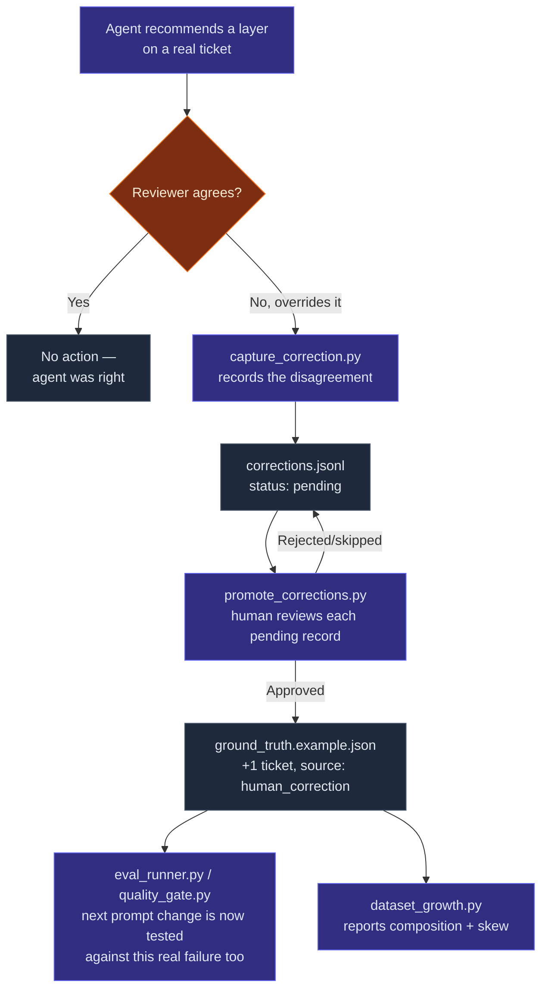

# Feedback loop — closing the gap between eval and reality

The eval gate (`evals/runner/`) answers "does this prompt still score well against
the dataset we already have?" It says nothing about whether that dataset still
reflects reality. Left alone, a static dataset goes stale: it only tests the
scenarios someone thought to write down at the start, and it never learns from
the cases where the agent was actually wrong in production.

This folder is the other half of the loop: capturing the moments a human
overrides the agent, and — after deliberate review — turning the good ones into
new, permanent eval fixtures.



## Why two steps, not one

A correction is captured the moment it happens — low friction, no review
required, just "the agent said X, the human said Y, here's why." But capturing
isn't the same as trusting. Not every override is a real labelling gap; some
are one-off judgment calls specific to that ticket, or a reviewer who
themselves got it wrong. `promote_corrections.py` is a second, deliberate act
that turns a raw disagreement into ground truth — and it's interactive by
default for exactly that reason.

## Files

| File | What it does |
|------|--------------|
| `capture_correction.py` | CLI to record one correction. Validates required fields (issue key, both layers, a stated reason, a reviewer) and appends a JSON record to `corrections.jsonl`. |
| `corrections.jsonl` | Append-only log, one correction per line. `status` is `pending`, `promoted`, or `rejected`. |
| `promote_corrections.py` | Walks pending corrections, shows each one in full, and on approval appends it to `evals/datasets/ground_truth.example.json` as a new ticket with `source: human_correction`, `verified: true`. |
| `validate_corrections.py` | CI check — confirms every promoted correction points at a real dataset ticket and every `human_correction` dataset ticket has a promoted record behind it. Exits 0/1, no model calls. |
| `dataset_growth.py` | Reports dataset composition (synthetic vs. human-corrected, per-layer distribution, verified rate) and flags class skew. Informational only — no exit code. |

## Usage

```bash
# 1. A reviewer overrides the agent's call on a real ticket — capture it immediately.
python evals/feedback/capture_correction.py \
  --issue-key PROJ-1042 \
  --summary "Retry logic for flaky third-party webhook delivery" \
  --agent-primary INTEGRATION \
  --agent-rationale "Touches real webhook delivery and retry queue." \
  --human-primary MANUAL \
  --human-note "Third-party webhook timing isn't reproducible in our test env; declined for automation." \
  --reviewer "j.doe"

# 2. Periodically, review what's piled up and promote the genuine gaps.
python evals/feedback/promote_corrections.py

# 3. Check the log and dataset agree (this is what CI runs).
python evals/feedback/validate_corrections.py

# 4. See how the dataset is composed and whether it's skewing.
python evals/feedback/dataset_growth.py
```

After promoting, the new ticket is just another row in the dataset — the next
prompt change is evaluated against it automatically the next time
`eval_runner.py` runs. No separate wiring needed.

## Honest limitations

- **No de-duplication.** Two reviewers correcting the same ticket produce two
  correction records. `promote_corrections.py` will reject the second on
  `issue_key` collision at promotion time, but there's no earlier warning.
- **No confidence weighting.** A promoted correction counts exactly as much as
  a synthetic ticket in the eval gate's aggregate score, even though it came
  from a real production disagreement. Weighting human corrections more
  heavily would be a reasonable next step once the dataset has enough of them
  to matter.
- **`--auto` exists but should be used sparingly.** It's there for demos and
  scripted re-runs against a known-good corrections file, not for routine use
  — the entire value of this loop is the deliberate human review at promotion
  time.
